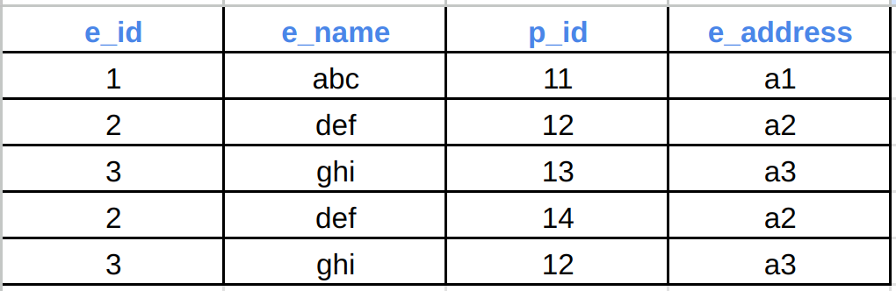

# What is data?
- Some information.

# File based system
- Prior to databases, data was stored in files like excel sheets.
- These files were stored in hard disks.
- The major problems with this system was of repeated data or data redundancy, difference in data or data inconsistency and security of data.

# Database
- It is a collection of related data.
- A well designed database solves the problem of redundancy and inconsistency.
- Easy app integration.

# DBMS
- Stands for database management system.
- It is like an interface between your app and the stored data.
- It provides a software to process queries and access data.
- Makes the process of creating, storing, updating and retriving of data as smooth as possible.
- It provides additional features like sharing of data, backup & recovery of data, add constraints to data.

# RDBMS
- Relational Database Management System is one of the most important DBMS where the data is stored in the form of tables.
- Real life entities are represented using tables.
- Properties of these entities are represented using columns.
- Individual row of the table represents each unique entity or the actual data to be stored.
- For a particular database, we can interrelate the data.
- Columns are also called as attributes and rows are also called as tuples.

# DB Schema
- Schema stands for blueprint.
- DB schema is a blueprint of the actual DB that we will create.
- It is not the actual DB but rather a design of structure of tables, how data will be stored, etc.

# Functional dependency
- Defines relationship between two attributes.
- X -> Y means Y is functionally dependant on X.
- X is a determinant.
- Y depends on X means that for every valid value of X we can uniquely identify Y.
- It can be easily achieved through primary key or unique key constraint.
- Without constraint we need to manually add some assertion if DB allows.
- But many of the modern DBMS like Postgres, MySQL, Oracle, etc don't have this feature of assertion.

# Axioms
- Rules for relational databases that revolves around functional dependency.

## Reflexivity:
- Consider for a table, we have columns as `address`, `state` and `house_no`.
- Here, `state` and `house_no` will be subset of `address`.
- So, `state` and `house_no` are functionally dependant on `address`.
- When designing the DB, this will be a redundant thing.
- So, if a attribute A is a subset of attribute B, then B -> A.
- This is reflexivity.

## Augmentation:
- Also called as partial dependency.
- If X -> Y, then XZ -> YZ for any Z.
- This is partial dependency.

- Here, `e_id` -> `e_name`.
- Also, (`e_id`, `p_id`) -> `e_name`.
- This means that we can fetch any `e_name` with (`e_id`, `p_id`).
- If at any point, an employee is involved in 100 projects and we need to update its address, then we will have to update this on 100 different rows.
- This happened because we have stored redundant data like `e_id = 2`, `e_id = 3`, `e_name = def`, `e_name = ghi`, `e_address = a2` and `e_address = a3`.
- There could have been much better design.
- The RHS should be completely dependant on LHS and not just part of it.
- In the above case, `e_name` has nothing to do with `p_id`.
- It is just partially dependant on `p_id`.
- This problem can be resolved using Normalization.

## Transitivity
- If X -> Y and Y -> Z, then X -> Z.
- Consider a table with attributes as `e_id`, `e_name`, `e_zip`, `e_state`.
- `e_id` -> `e_zip` and `e_zip` -> `e_state`, then `e_id` -> `e_state`.
- If for any two employees having unique `e_id` and `e_name` are living in same state, then their `e_zip` and `e_state` will be same and if at any point the name of the state was changed by the government, then we will again have to update many rows.
- 